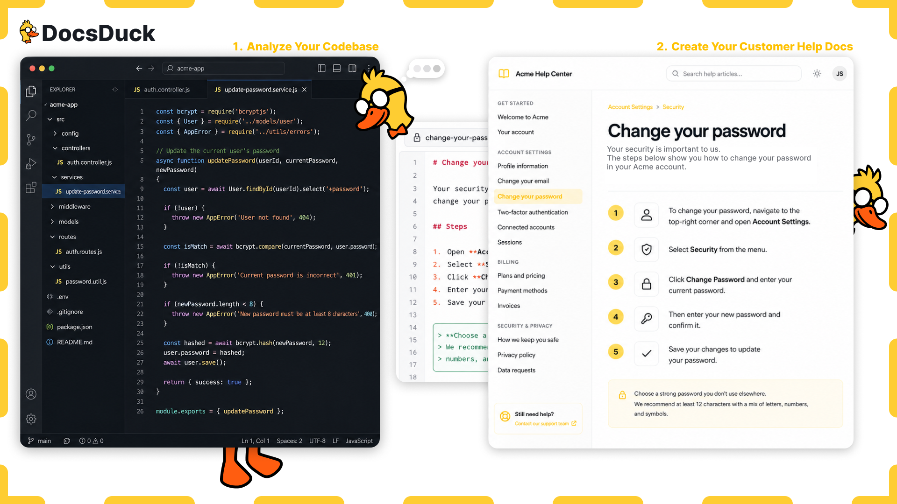

<p align="center">
  
</p>

<h1 align="center">DocsDuck</h1>

<p align="center">
  <strong>Turn your codebase into documentation that stays accurate as your product evolves.</strong>
</p>

<p align="center">
  Open-source Agent Skills for generating and maintaining customer-facing help docs and internal product documentation directly from your codebase.
</p>

<p align="center">
  <a href="#why-docsduck">Why DocsDuck</a> ·
  <a href="#two-documentation-layers">Skills</a> ·
  <a href="#how-it-works">How it works</a> ·
  <a href="#configuration">Configuration</a> ·
  <a href="#version-history-and-auditability">Version history</a> ·
  <a href="#installation">Installation</a> ·
  <a href="#enterprise-use">Enterprise</a> ·
  <a href="#roadmap">Roadmap</a>
</p>

---

## Documentation should not become outdated the moment your product changes

Most product documentation starts with good intentions.

Then the interface changes.

A button is renamed. A workflow gains another step. A permission model changes. A feature moves to a different page. A support agent discovers that an article no longer matches the product, but the documentation remains unchanged for weeks or months.

The result is predictable:

- Customers follow incorrect instructions.
- Support teams answer the same questions repeatedly.
- Internal teams rely on tribal knowledge.
- New employees take longer to understand the product.
- Developers spend time explaining features they already implemented.
- Support tickets increase because the knowledge base cannot be trusted.
- Documentation updates are postponed until someone has time to rewrite them manually.

DocsDuck helps make the product itself the source of truth.

It analyzes the codebase, identifies product workflows, verifies visible interface terminology, and creates documentation for the people who use, support, operate, and maintain the product.

> **Your product changes. DocsDuck updates the docs.**

---

## Why DocsDuck?

Documentation is not only a writing problem.

It is a synchronization problem.

Traditional documentation workflows depend on someone remembering to update an article after the product has already changed. That process is slow, difficult to scale, and easy to forget.

DocsDuck moves documentation closer to the software development lifecycle.

```text
Product code
     ↓
Routes, components, labels, permissions and workflows
     ↓
DocsDuck
     ↓
Customer help docs and internal documentation
```

Instead of starting from a blank page, teams can generate structured documentation from evidence already present in the product:

- Application routes
- Navigation structures
- UI components
- Buttons and menu labels
- Forms and validation rules
- Permissions and role checks
- Feature flags
- Success and error states
- Integration logic
- Existing tests
- Existing documentation
- Relevant code changes

DocsDuck is designed to reduce the time required to create documentation, improve consistency across articles, and make it easier to identify content that may have become outdated.

---

## Reduce support cost by making self-service documentation trustworthy

A knowledge base only reduces support workload when customers trust it.

Outdated documentation creates the opposite effect. Customers attempt to follow incorrect steps, fail to complete the task, and contact support with even more confusion than before.

DocsDuck helps teams create documentation that reflects the product customers actually use.

This can help organizations:

- Deflect repetitive support questions through better self-service.
- Reduce the time support agents spend rewriting the same instructions.
- Improve first-response quality with more reliable internal references.
- Shorten resolution times by documenting permissions, limitations, and expected outcomes.
- Reduce onboarding time for new support and customer-success employees.
- Identify affected articles when product terminology or workflows change.
- Maintain documentation across a growing product without scaling manual writing at the same rate.
- Give customers consistent instructions across help centers, onboarding material, and support responses.

DocsDuck does not replace editorial review or product knowledge.

It removes much of the repetitive discovery and drafting work required before that review can begin.

---

## Two documentation layers

DocsDuck contains two focused Agent Skills.

Each skill analyzes the same product from a different perspective and writes for a different audience.

```text
DocsDuck
├── DocsDuck External
│   └── Documentation for customers and end users
└── DocsDuck Internal
    └── Documentation for employees and internal teams
```

### DocsDuck External

DocsDuck External creates customer-facing documentation that explains how to use the product.

It focuses on customer goals, visible product language, and clear step-by-step instructions.

Typical outputs include:

- Help center articles
- Knowledge base content
- Product guides
- Onboarding instructions
- Troubleshooting articles
- Account and security guides
- Billing documentation
- Integration setup instructions
- Role- and permission-specific guidance

Example articles:

```text
How to invite a team member
How to change your password
How to export a report
How to connect an integration
How to update billing information
How to manage employee permissions
```

DocsDuck External avoids unnecessary implementation details.

It should explain:

> Open **Settings**, select **Security**, and choose **Change password**.

It should not explain:

> The settings component invokes the password mutation through the authentication service.

External documentation is written for the person trying to complete a task—not the developer who implemented it.

### DocsDuck Internal

DocsDuck Internal creates documentation for the teams responsible for building, supporting, operating, and maintaining the product.

Typical outputs include:

- Engineering documentation
- Product architecture
- Authentication and authorization flows
- Database and domain-model documentation
- Integration behavior
- Internal admin procedures
- Support playbooks
- Incident-response instructions
- Deployment and environment documentation
- Employee onboarding material
- Operational workflows
- Troubleshooting procedures

Example articles:

```text
How employee invitations work internally
Authentication and session lifecycle
Tenant authorization model
How failed payments are processed
How support should investigate account access issues
How the integration synchronization flow works
```

Internal documentation may include implementation details, relevant services, dependencies, data flow, and source references when they help internal teams understand or operate the system.

---

## One codebase. Two documentation layers.

The external and internal skills are intentionally separate.

Customer documentation should be simple, task-focused, and free from internal implementation details.

Internal documentation should provide the technical and operational context required by employees.

Combining both audiences in the same article often produces documentation that is too technical for customers and too shallow for internal teams.

DocsDuck keeps those audiences separate while allowing both documentation layers to remain connected to the same source of truth.

| Area | DocsDuck External | DocsDuck Internal |
|---|---|---|
| Primary audience | Customers and end users | Engineering, support, operations and product teams |
| Main purpose | Help users complete tasks | Explain how the product works internally |
| Technical depth | Low | Medium to high |
| UI terminology | Required | Included where relevant |
| Architecture details | Excluded | Included |
| Source references | Hidden or optional | Recommended |
| Typical destination | Intercom, Zendesk, GitBook, Help Scout | Internal GitBook, Notion, repository docs, engineering wiki |

---

## How it works

DocsDuck instructs a compatible coding agent to inspect the product systematically before generating documentation.

### 1. Understand the repository

The agent identifies:

- Framework and application structure
- Customer-facing routes
- Navigation patterns
- Major product areas
- Authentication flows
- Roles and permissions
- Feature flags
- Existing documentation
- Tests that demonstrate real workflows
- Relevant integrations and external dependencies

Generated files, build output, dependency directories, and unrelated tooling should be excluded from analysis.

### 2. Build a product inventory

DocsDuck creates an internal inventory of features and workflows.

For each workflow, it may identify:

- User goal
- Starting point
- Relevant page or route
- Required permission
- Visible labels
- Required fields
- Validation behavior
- Success state
- Error states
- Related source files
- Existing documentation that may already cover the workflow

This inventory helps the agent avoid producing duplicate, trivial, or unsupported articles.

### 3. Verify the workflow

Before writing instructions, DocsDuck looks for evidence supporting each step.

Useful evidence may include:

- Route definitions
- Navigation components
- Page headings
- Button labels
- Form fields
- Validation messages
- Dialogs
- Confirmation screens
- Permission checks
- Feature flags
- Automated tests
- Existing product copy

DocsDuck should never invent a page, field, button, permission, or outcome that cannot be supported by the repository.

### 4. Generate structured documentation

The skill generates task-focused Markdown using predictable structures, metadata, categories, and file naming conventions.

Example:

```md
---
title: Change your password
description: Learn how to update the password used to access your account.
category: Account and security
status: draft
---

# Change your password

A strong password helps protect your account and personal information.

## Before you begin

You must be signed in to your account.

## Change your password

1. Open your profile menu.
2. Select **Settings**.
3. Open **Security**.
4. Select **Change password**.
5. Enter your current password.
6. Enter and confirm your new password.
7. Select **Update password**.

Your new password is active immediately.
```

### 5. Connect the article to its sources

Generated documentation can include non-customer-facing references:

```md
<!--
DocsDuck sources:
- app/settings/security/page.tsx
- components/change-password-form.tsx
- tests/account/change-password.spec.ts
-->
```

These references make future verification and maintenance easier.

### 6. Review documentation after product changes

When code changes, DocsDuck can inspect the relevant diff and identify potentially affected documentation.

Examples of documentation-impacting changes:

- A button was renamed.
- A page moved to a different route.
- A workflow gained or lost a step.
- A permission requirement changed.
- A form field became mandatory.
- An integration setup process changed.
- A success or error message was updated.
- A feature was placed behind a feature flag.

Affected articles can be classified as:

- Current
- Possibly outdated
- Outdated
- Unable to verify

Focused updates are preferred over regenerating the entire knowledge base.

---

## Configuration

DocsDuck can be configured independently for each product repository.

The Agent Skills format does not interpret DocsDuck configuration automatically. Instead, each DocsDuck skill is explicitly instructed to look for a `docsduck.config.yml` file in the root of the product repository before generating, updating, or publishing documentation.

This allows each project to define its own:

- Output directories
- Documentation languages
- Writing style
- Documentation audiences
- Enabled integrations
- Publishing behavior
- Review requirements
- Version-control behavior
- Ignored directories
- Sensitive-content rules
- Knowledge base destinations

Example:

```yaml
version: 1

output:
  mode: files
  external_directory: docs/external
  internal_directory: docs/internal

publishing:
  enabled: false
  strategy: draft
  require_confirmation: true

  intercom:
    enabled: false

  zendesk:
    enabled: false

  gitbook:
    enabled: false

  help_scout:
    enabled: false

version_control:
  enabled: true
  provider: git
  create_commit: false

history:
  enabled: true
  record_diff_summary: true
  record_content_hash: true

safety:
  require_confirmation_before_external_write: true
  never_publish_unverified_content: true
```

When no configuration file exists, DocsDuck should use safe defaults:

```yaml
output:
  mode: files

publishing:
  enabled: false
  strategy: draft
  require_confirmation: true

version_control:
  enabled: true
  provider: git
  create_commit: false

safety:
  require_confirmation_before_external_write: true
```

These defaults mean that DocsDuck may create or update local documentation files, but it must not publish content externally or create Git commits without explicit authorization.

### Output modes

#### Files

```yaml
output:
  mode: files
```

Creates or updates local Markdown files.

No external knowledge base is modified.

This is the safest default and is recommended for initial adoption.

#### Publish

```yaml
output:
  mode: publish
```

Publishes documentation through an available integration or MCP-compatible tool.

Local Markdown files are not required unless separately configured.

Publishing is only permitted when:

1. External publishing is enabled.
2. The selected destination is enabled.
3. A compatible tool or MCP integration is available.
4. The current agent has permission to use it.
5. The requested content has passed DocsDuck verification.
6. The required confirmation has been provided.

#### Both

```yaml
output:
  mode: both
```

Updates local Markdown files and synchronizes the same documentation with an external knowledge base.

This is the recommended configuration for mature teams because it allows Git to remain the canonical, reviewable source while Intercom, Zendesk, GitBook, Help Scout, or another platform acts as a publishing destination.

#### Dry run

```yaml
output:
  mode: dry-run
```

Analyzes the product and reports what documentation should be created, updated, or reviewed without writing files or modifying external services.

Dry runs are useful for:

- Pull-request checks
- Release readiness
- Documentation impact reports
- Initial repository analysis
- Security-sensitive environments
- Reviewing proposed changes before execution

---

## MCP and external integrations

DocsDuck can use available MCP servers, connectors, or agent tools to update external documentation systems.

The skill itself does not provide credentials or automatically connect to external services.

Instead, DocsDuck checks whether the current agent runtime already has authorized access to a compatible integration.

Potential destinations include:

- Intercom
- Zendesk
- GitBook
- Help Scout
- Notion
- Confluence
- Custom content-management systems
- Internal documentation platforms

DocsDuck should only use an external integration when all of the following are true:

1. `publishing.enabled` is `true`.
2. The selected integration has `enabled: true`.
3. A compatible tool or MCP server is available.
4. The current execution environment is authorized to use it.
5. The requested action is supported by the integration.
6. The content has passed DocsDuck verification.
7. The configured confirmation requirements have been satisfied.

If one or more requirements are not met, DocsDuck must:

- Avoid external write operations.
- Never claim that content was published.
- Fall back to local files when `output.mode` is `both`.
- Explain the missing requirement when `output.mode` is `publish`.
- Preserve generated content as a reviewable draft when possible.

### Draft-first publishing

External publishing should be draft-first by default.

```yaml
publishing:
  enabled: true
  strategy: draft
  require_confirmation: true
```

Supported strategies may include:

```text
draft
review
publish
```

`publish` should never be the default.

A production-safe configuration should require explicit confirmation before modifying publicly visible documentation:

```yaml
publishing:
  enabled: true
  strategy: publish
  require_confirmation: true
```

DocsDuck must never claim that an article was created, updated, synchronized, reviewed, approved, or published unless the corresponding action completed successfully.

---

## Canonical documentation and external synchronization

For most organizations, local Markdown stored in Git should remain the canonical documentation source.

```text
Product codebase
       ↓
DocsDuck analyzes verified product behavior
       ↓
Canonical Markdown stored in Git
       ↓
Reviewable pull request and diff
       ↓
Approved content
       ↓
Intercom, Zendesk, GitBook or another destination
```

This approach provides:

- Reviewable documentation changes
- Pull-request approvals
- Clear ownership
- Rollback
- Source-linked documentation
- Stable article identity
- Reproducible publishing
- Independence from a single documentation vendor
- Protection against accidental external changes

External platforms should normally be treated as synchronization and presentation layers rather than the only copy of the documentation.

---

## Stable article identity

DocsDuck should assign each article a permanent identifier.

Articles must not be matched solely by title because titles can change over time.

Example:

```yaml
---
docsduck_id: external-account-change-password
title: Change your password
description: Learn how to update the password used to access your account.
category: Account and security
status: draft

sources:
  - app/settings/security/page.tsx
  - components/change-password-form.tsx
  - tests/account/change-password.spec.ts

integrations:
  intercom:
    article_id: "123456789"
    last_synced_at: "2026-07-24T12:00:00Z"

  gitbook:
    page_id: null
---
```

The `docsduck_id` should remain unchanged even when:

- The article title changes
- The file is moved
- The category changes
- The article is translated
- The external destination changes
- Product terminology is updated

Stable identifiers help prevent duplicate content such as:

```text
Change your password
Change your password (2)
Change your password updated
New change password guide
```

When a known external article ID exists, DocsDuck should update that article rather than creating another one.

When no safe match can be verified, DocsDuck should create a new draft rather than modifying an uncertain article.

---

## Version history and auditability

DocsDuck uses Git as the primary version-history system for generated Markdown documentation.

The same article should normally be updated in the same file:

```text
docs/external/account/change-your-password.md
```

DocsDuck should not create unnecessary versioned duplicates such as:

```text
change-your-password-v1.md
change-your-password-v2.md
change-your-password-final.md
change-your-password-final-2.md
```

Git already records:

- Who made the change
- When the change was made
- What content changed
- Which lines were added or removed
- The commit message
- The branch and pull request
- Review and approval history
- The ability to restore a previous version

Example commands:

```bash
git log --follow -- docs/external/account/change-your-password.md
```

View the detailed history of the article:

```bash
git log -p -- docs/external/account/change-your-password.md
```

See who last changed each line:

```bash
git blame docs/external/account/change-your-password.md
```

View a previous version:

```bash
git show <commit-hash>:docs/external/account/change-your-password.md
```

Restore a previous version:

```bash
git restore --source=<commit-hash> \
  docs/external/account/change-your-password.md
```

This makes documentation changes reviewable in the same workflow already used for application code.

### Documentation changes through pull requests

DocsDuck is designed to support documentation review through normal Git workflows.

```text
Product change
      ↓
DocsDuck identifies affected documentation
      ↓
Existing Markdown files are updated
      ↓
A Git diff is created
      ↓
The team reviews the documentation
      ↓
Approved changes are merged
      ↓
External help centers are synchronized
```

This allows teams to include documentation review in:

- Feature pull requests
- Release pull requests
- Security reviews
- Product approvals
- Localization workflows
- Support enablement
- Compliance review
- Change-management processes

### Article attribution

DocsDuck may add current article metadata to the Markdown frontmatter:

```yaml
---
docsduck_id: external-account-change-password
title: Change your password
status: approved

created_at: 2026-07-24T12:00:00Z
created_by:
  type: agent
  name: DocsDuck External

last_updated_at: 2026-07-24T14:32:00Z
last_updated_by:
  type: human
  name: Felix Reveman

review:
  status: approved
  reviewed_by: Anna Andersson
  reviewed_at: 2026-07-24T15:10:00Z
---
```

DocsDuck must never guess a person's identity.

Attribution may only be taken from reliable sources such as:

- Git author information
- The authenticated agent user
- GitHub or GitLab identity
- A connected documentation platform
- An explicitly configured project identity
- A user-provided approval action

When a reliable human identity is unavailable, DocsDuck should attribute the change to the agent:

```yaml
last_updated_by:
  type: agent
  name: DocsDuck External
```

### Human approval

Machine-generated content and human approval should be recorded separately.

Example:

```yaml
generation:
  generated_by: DocsDuck External
  generated_at: 2026-07-24T14:32:00Z

review:
  status: approved
  reviewed_by: Felix Reveman
  reviewed_at: 2026-07-24T15:10:00Z
```

An agent-generated update must not automatically be represented as human-approved.

DocsDuck should only record an approval when a known human explicitly approved the content or when a verified external review workflow reports that approval.

### Optional DocsDuck audit log

Git should remain the primary version-history system.

For organizations that need an additional machine-readable audit trail, DocsDuck may maintain an append-only log:

```text
.docsduck/
└── history/
    └── external-account-change-password.jsonl
```

Example:

```json
{"revision":1,"timestamp":"2026-07-24T12:00:00Z","actor":{"type":"agent","name":"DocsDuck External"},"action":"created","commit":"a13fc2e"}
{"revision":2,"timestamp":"2026-07-24T14:32:00Z","actor":{"type":"human","name":"Felix Reveman"},"action":"updated","summary":"Updated navigation labels","commit":"c84dd91"}
{"revision":3,"timestamp":"2026-07-24T15:10:00Z","actor":{"type":"human","name":"Anna Andersson"},"action":"approved","commit":"c84dd91"}
```

An audit event may include:

- Article ID
- Revision number
- Timestamp
- Actor
- Action
- Change summary
- Git commit
- Content hash
- Review status
- Publishing status
- External article ID
- External revision ID

Example configuration:

```yaml
history:
  enabled: true
  format: jsonl
  directory: .docsduck/history
  record_content_hash: true
  record_diff_summary: true

attribution:
  use_git_identity: true
  fallback_actor: DocsDuck
  require_known_human_for_approval: true
```

The optional audit log supplements Git. It should not replace Git history or duplicate full article contents unnecessarily.

### External revision history

When an external platform provides revision information, DocsDuck may store it:

```yaml
integrations:
  intercom:
    article_id: "123456789"
    external_revision: "42"
    last_synced_at: 2026-07-24T15:15:00Z
    last_synced_by:
      type: agent
      name: DocsDuck External
```

DocsDuck must only record revision IDs, actor identities, timestamps, and publishing states that were actually returned or verified by the external integration.

Different platforms expose different revision capabilities. DocsDuck should never invent unavailable external history.

---

## Safe update behavior

Before updating an existing local or external article, DocsDuck should:

1. Resolve the stable `docsduck_id`.
2. Read the existing article.
3. Verify the source files associated with the workflow.
4. Identify only the claims affected by the product change.
5. Preserve unaffected editorial content.
6. Generate a focused diff.
7. Record uncertainty or unverifiable behavior.
8. Avoid creating a duplicate article.
9. Respect the configured output and publishing mode.
10. Request confirmation before external writes when required.

DocsDuck should prefer focused updates over full regeneration.

A renamed button should normally update the affected instruction—not rewrite the entire article unnecessarily.

---

## Recommended production configuration

A safe production configuration may look like this:

```yaml
version: 1

output:
  mode: both
  external_directory: docs/external
  internal_directory: docs/internal

publishing:
  enabled: true
  strategy: draft
  require_confirmation: true

  intercom:
    enabled: true

  zendesk:
    enabled: false

  gitbook:
    enabled: false

version_control:
  enabled: true
  provider: git
  create_commit: false

history:
  enabled: true
  format: jsonl
  directory: .docsduck/history
  record_content_hash: true
  record_diff_summary: true

attribution:
  use_git_identity: true
  fallback_actor: DocsDuck
  require_known_human_for_approval: true

safety:
  require_confirmation_before_external_write: true
  never_publish_unverified_content: true
```

With this configuration:

- Markdown remains the canonical source.
- Git stores the complete version history.
- DocsDuck updates known files rather than creating duplicates.
- Intercom drafts may be updated when authorized MCP access is available.
- Public publishing requires confirmation.
- Human approval is recorded separately from agent generation.
- A machine-readable audit trail may be created.
- Every external article remains connected to a stable DocsDuck ID.

---

## Documentation that follows product development

DocsDuck is intended to become part of the product development workflow rather than a separate writing project.

```text
Developer changes product
          ↓
DocsDuck analyzes relevant changes
          ↓
Affected documentation is identified
          ↓
Updated drafts are generated
          ↓
Team reviews and publishes
```

This makes it possible to move toward documentation practices such as:

- Documentation review during pull requests
- Automatic identification of affected help articles
- Draft updates after product releases
- Documentation quality checks in CI
- Source-linked articles
- Consistent terminology validation
- Detection of references to removed routes or labels

The goal is not to publish unchecked content automatically.

The goal is to ensure documentation maintenance is no longer dependent on someone noticing every change manually.

---

## Example use cases

### Create a new customer knowledge base

```text
Use DocsDuck External to analyze this repository and create a complete
customer-facing knowledge base for the primary product workflows.
```

### Document one product area

```text
Use DocsDuck External to create help docs for account settings,
authentication, password management, and user profiles.
```

### Review documentation after a release

```text
Use DocsDuck External to compare the latest product changes with the
existing help documentation and update affected articles.
```

### Create support documentation

```text
Use DocsDuck Internal to document how support agents should investigate
failed invitations, login problems, and permission-related issues.
```

### Document system architecture

```text
Use DocsDuck Internal to document the authentication, authorization,
session management, and tenant-isolation architecture.
```

### Document an integration

```text
Use DocsDuck External to create customer setup instructions for the Stripe
integration, then use DocsDuck Internal to document how synchronization,
webhooks, retries, and error handling work.
```

---

## Repository structure

```text
DocsDuck/
├── README.md
├── LICENSE
├── docsduckbanner.png
└── skills/
    ├── docsduck-external/
    │   ├── SKILL.md
    │   └── references/
    └── docsduck-internal/
        ├── SKILL.md
        └── references/
```

Each skill is self-contained and can be installed independently.

---

## Installation

DocsDuck uses the open Agent Skills format.

The same skill content can be used with compatible coding agents, although installation directories may differ between tools.

Clone the repository:

```bash
git clone https://github.com/felixreveman/DocsDuck.git
cd DocsDuck
```

### Install both skills for Codex and compatible agents

```bash
mkdir -p ~/.agents/skills

cp -R skills/docsduck-external ~/.agents/skills/docsduck-external
cp -R skills/docsduck-internal ~/.agents/skills/docsduck-internal
```

### Install both skills for Claude Code

```bash
mkdir -p ~/.claude/skills

cp -R skills/docsduck-external ~/.claude/skills/docsduck-external
cp -R skills/docsduck-internal ~/.claude/skills/docsduck-internal
```

### Install only the external skill

```bash
cp -R skills/docsduck-external ~/.agents/skills/docsduck-external
```

### Install inside a specific project

You can also install the skills inside an individual repository:

```text
your-project/
└── .agents/
    └── skills/
        ├── docsduck-external/
        │   └── SKILL.md
        └── docsduck-internal/
            └── SKILL.md
```

Consult the documentation for your coding agent to confirm its supported skill directory.

---

## Suggested output structure

Unless another structure is requested, DocsDuck can organize generated content like this:

```text
docs/
├── external/
│   ├── getting-started/
│   ├── account/
│   ├── workspace/
│   ├── team-management/
│   ├── billing/
│   ├── integrations/
│   └── troubleshooting/
└── internal/
    ├── architecture/
    ├── engineering/
    ├── support/
    ├── operations/
    ├── integrations/
    ├── security/
    └── onboarding/
```

Example filenames:

```text
docs/external/account/change-your-password.md
docs/external/team-management/invite-a-team-member.md
docs/internal/security/authentication-lifecycle.md
docs/internal/support/investigate-failed-invitations.md
```

---

## Customer-facing documentation principles

DocsDuck External should generate content that is:

- Written for customers rather than developers
- Focused on one clear customer goal
- Based on verified product behavior
- Consistent with visible interface terminology
- Explicit about prerequisites and permissions
- Easy to scan
- Clear about the expected outcome
- Free from unnecessary implementation details
- Honest when a workflow cannot be fully verified

Exact product labels should be preserved and formatted consistently:

```md
Open **Settings**.
Select **Invite employee**.
Choose **Save changes**.
```

If the interface says **Invite employee**, DocsDuck should not rewrite it as **Add staff member**.

---

## Internal documentation principles

DocsDuck Internal should generate content that is:

- Useful to engineering, support, product, and operations teams
- Clear about system boundaries and responsibilities
- Connected to relevant source files
- Explicit about dependencies and assumptions
- Accurate about permissions and security behavior
- Structured around real operational or engineering questions
- Clear about failure modes and troubleshooting steps
- Suitable for onboarding new employees
- Updated when implementation details change

Internal documentation should distinguish between:

- Verified behavior
- Inferred behavior
- Environment-specific behavior
- Missing information
- Areas requiring human confirmation

---

## Enterprise use

DocsDuck is designed to support documentation workflows in larger products and organizations.

Potential enterprise use cases include:

### Support enablement

Give support agents a reliable internal reference for product behavior, permissions, common errors, and escalation paths.

### Customer self-service

Maintain a help center that reflects the current interface and allows customers to solve more problems without contacting support.

### Product operations

Document workflows shared across support, implementation, customer success, and product teams.

### Engineering onboarding

Help new developers understand system architecture, domain models, integrations, and operational responsibilities.

### Release readiness

Review documentation impact as part of feature delivery and release processes.

### Multi-product documentation

Generate separate documentation trees for different applications, modules, roles, plans, or customer segments.

### Regulated environments

Maintain traceable documentation with source references and explicit verification status.

### Documentation governance

Use Git history, pull requests, stable article IDs, explicit ownership, human approval, and optional audit logs to make documentation changes traceable and reviewable.

This can support organizations that require:

- Change approval
- Named reviewers
- Documentation ownership
- Release traceability
- Historical reconstruction
- Rollback
- Separation between machine generation and human approval
- Evidence of when documentation was updated

### Knowledge base synchronization

Maintain Markdown as the canonical source while synchronizing approved documentation with external help centers through available MCP servers or authorized agent tools.

This can reduce:

- Duplicate writing
- Manual copying between systems
- Inconsistent article versions
- Accidental creation of duplicate articles
- Dependence on a single documentation vendor
- Time spent reconciling internal and external documentation

DocsDuck can be used with private repositories, but organizations are responsible for selecting coding agents and model providers that meet their security, privacy, contractual, and data-residency requirements.

---

## Security and privacy

Codebases may contain confidential architecture, credentials, business logic, customer information, and commercially sensitive data.

Before using DocsDuck with a private repository:

- Review the data-handling policy of the selected coding agent.
- Review the data-retention policy of the model provider.
- Confirm whether prompts or code may be used for model training.
- Exclude secrets, credentials, private keys, and production environment files.
- Avoid exposing customer data.
- Apply repository access controls.
- Review generated documentation before publishing it publicly.
- Ensure internal implementation details are not accidentally included in external docs.

DocsDuck itself is a set of instructions and supporting resources. The security properties of an execution depend on the agent, tools, permissions, model provider, and environment in which the skill is used.

---

## Publishing and integrations

DocsDuck initially generates structured Markdown, but it can also work with authorized MCP servers, connectors, and agent tools when available.

Potential output and synchronization targets include:

- Intercom
- Zendesk
- GitBook
- Help Scout
- Notion
- Confluence
- Markdown documentation sites
- Static-site generators
- Repository-hosted documentation
- Custom help centers
- Internal content-management systems

DocsDuck supports local, external, combined, and dry-run workflows:

```text
files
publish
both
dry-run
```

Local Markdown stored in Git is the recommended canonical source for most teams.

External platforms should normally act as synchronized publishing destinations.

A generated document must be treated as a draft unless it has been successfully reviewed and published through an actual integration.

DocsDuck must never claim that content was created, updated, synchronized, reviewed, approved, or published unless the corresponding action completed successfully.

External write operations require:

- Explicit configuration
- An available compatible integration
- Valid authorization
- Sufficient tool permissions
- Verified documentation
- Any required human confirmation

When external publishing is unavailable, DocsDuck should preserve the generated content locally whenever the configured output mode allows it.

Stable `docsduck_id` values and stored external article IDs should be used to update known articles safely and prevent duplicates.

---

## What DocsDuck is not

DocsDuck is not primarily:

- An API reference generator
- A replacement for code comments
- A generic README generator
- A codebase chat interface
- A customer-support chatbot
- A product analytics platform
- A fully autonomous publishing system
- A substitute for legal, security, or compliance review

DocsDuck focuses on turning product implementation into accurate, maintainable documentation for internal teams and customers.

---

## Current status

DocsDuck is currently under active development.

The project is not yet considered production-stable.

Interfaces, instructions, output formats, supported agents, and installation processes may change before the first stable release.

Early users are encouraged to test DocsDuck on real products and report:

- Unsupported frameworks
- Incorrect workflow detection
- Hallucinated instructions
- Missing permissions
- Inconsistent terminology
- Poor article organization
- Documentation that becomes outdated after code changes
- Agent-specific compatibility issues

---

## Roadmap

### Core skills

- [ ] DocsDuck External initial skill
- [ ] DocsDuck Internal initial skill
- [ ] Shared documentation principles
- [ ] Structured Markdown output
- [ ] Category and article templates
- [ ] Source references
- [ ] Verification status metadata

### Product understanding

- [ ] Route detection
- [ ] Navigation analysis
- [ ] UI-label extraction
- [ ] Role and permission detection
- [ ] Feature-flag detection
- [ ] Form and validation analysis
- [ ] Test-assisted workflow verification
- [ ] Multi-tenant product support

### Maintenance

- [ ] Git diff analysis
- [ ] Documentation impact detection
- [ ] Outdated article classification
- [ ] Terminology drift detection
- [ ] Removed route detection
- [ ] Focused article updates
- [ ] Documentation review reports

### Output and integrations

- [ ] Intercom export
- [ ] Zendesk export
- [ ] GitBook export
- [ ] Help Scout export
- [ ] Notion export
- [ ] Static-site output
- [ ] Configurable frontmatter
- [ ] Localization support

### Configuration and integrations

- [ ] Project-level `docsduck.config.yml`
- [ ] Files, publish, both, and dry-run output modes
- [ ] Safe default configuration
- [ ] MCP integration discovery
- [ ] Draft-first external publishing
- [ ] Explicit confirmation before public writes
- [ ] Intercom article synchronization
- [ ] Zendesk article synchronization
- [ ] GitBook page synchronization
- [ ] Help Scout article synchronization
- [ ] Stable external article mapping
- [ ] Publishing failure recovery
- [ ] Integration capability reporting

### Version history and governance

- [ ] Stable `docsduck_id` values
- [ ] Git-based article history
- [ ] Focused article updates
- [ ] Duplicate article prevention
- [ ] Human and agent attribution
- [ ] Separate generation and approval metadata
- [ ] Optional JSONL audit logs
- [ ] Content hashes
- [ ] Diff summaries
- [ ] External revision tracking
- [ ] Documentation ownership metadata
- [ ] Pull-request documentation reports
- [ ] Rollback guidance
- [ ] Approval workflow support

### Quality and enterprise readiness

- [ ] Output validation
- [ ] Hallucination checks
- [ ] Sensitive-content detection
- [ ] Configurable terminology rules
- [ ] Documentation ownership metadata
- [ ] Approval workflows
- [ ] CI integration
- [ ] Monorepo support
- [ ] Large-repository optimization

---

## Contributing

Contributions are welcome.

Useful contributions include:

- Improving the external or internal skill instructions
- Adding framework-specific references
- Testing DocsDuck against real repositories
- Creating output validators
- Improving permission and feature-flag detection
- Building publishing integrations
- Adding example applications
- Reporting inaccurate or unsupported documentation
- Improving compatibility with coding agents

For large changes, open an issue before starting implementation so the approach can be discussed.

---

## Design principles

DocsDuck is built around several principles:

### Evidence before output

Documentation must be supported by the product implementation.

### Customers should not read engineering documentation

External content should focus on user goals and visible product behavior.

### Internal teams need more than a code summary

Internal content should explain system behavior, dependencies, operations, failure modes, and ownership.

### Focused updates are better than full regeneration

A small UI change should not unnecessarily rewrite an entire knowledge base.

### Documentation should be reviewable

Generated content should make assumptions, uncertainty, and source references visible to maintainers.

### The codebase is a source of truth—not the only source

Product behavior may also depend on configuration, infrastructure, external services, feature flags, and business processes that are not fully represented in application code.

DocsDuck should acknowledge those limits rather than invent missing details.

---

## Frequently asked questions

### Does DocsDuck work with every LLM?

Not automatically.

DocsDuck uses the Agent Skills format and requires a coding agent or runtime that can discover and load skill instructions.

Compatibility depends on the surrounding agent application, not only the underlying language model.

### Does DocsDuck create a new file every time an article changes?

No.

DocsDuck should normally update the same Markdown file and rely on Git for version history, line-level attribution, comparison, and rollback.

Creating separate `v1`, `v2`, and `final` files would create duplicates and make synchronization harder.

### Can DocsDuck update Intercom, Zendesk, or GitBook directly?

Yes, when the current coding agent has access to an authorized compatible MCP server, connector, or tool.

The relevant integration must also be enabled in `docsduck.config.yml`.

External writes should be draft-first and may require explicit confirmation.

### What happens when an integration is unavailable?

DocsDuck must not claim that publishing succeeded.

When the output mode is `both`, DocsDuck should still update the local Markdown source and report that external synchronization could not be completed.

When the output mode is `publish`, DocsDuck should explain which capability, authorization, or integration is missing.

### How does DocsDuck know which external article to update?

Each article receives a stable `docsduck_id`.

External article IDs returned by platforms such as Intercom or GitBook can be stored in the article metadata. Future runs use those identifiers to update the known article rather than creating duplicates.

### Can DocsDuck show who changed an article?

Yes.

Git provides the primary record of who changed the file, when it changed, and exactly what changed.

DocsDuck may also store current attribution, reviewer information, approval status, and optional audit events. It must never guess a person's identity or represent agent-generated content as human-approved.

### Does DocsDuck publish directly to Intercom or Zendesk?

Not by itself.

DocsDuck can use an authorized compatible MCP server, connector, or agent tool when one is available and enabled in the project configuration.

### Can DocsDuck analyze private repositories?

Yes, when used through a compatible coding agent with access to the repository.

Organizations must evaluate the security and privacy policies of the selected agent and model provider.

### Can DocsDuck replace technical writers?

DocsDuck is intended to reduce repetitive discovery, drafting, and maintenance work.

Human review remains important for tone, product strategy, complex workflows, compliance, localization, and editorial quality.

### Can DocsDuck update existing documentation?

That is a core use case.

DocsDuck is designed to compare code changes with existing documentation and identify content that may require review or revision.

### Does DocsDuck require a specific framework?

The goal is to remain framework-independent.

Quality may vary depending on project structure, available tests, naming conventions, and how clearly product behavior is represented in the repository.

---

## License

DocsDuck is licensed under the [Apache License 2.0](./LICENSE).

```text
Copyright 2026 Felix Reveman
```

---

<p align="center">
  <strong>One codebase. Two documentation layers.</strong>
</p>

<p align="center">
  Customer help docs for the people using your product.<br />
  Internal documentation for the teams building and supporting it.
</p>

<p align="center">
  <strong>Code changes. DocsDuck updates the docs.</strong>
</p>
